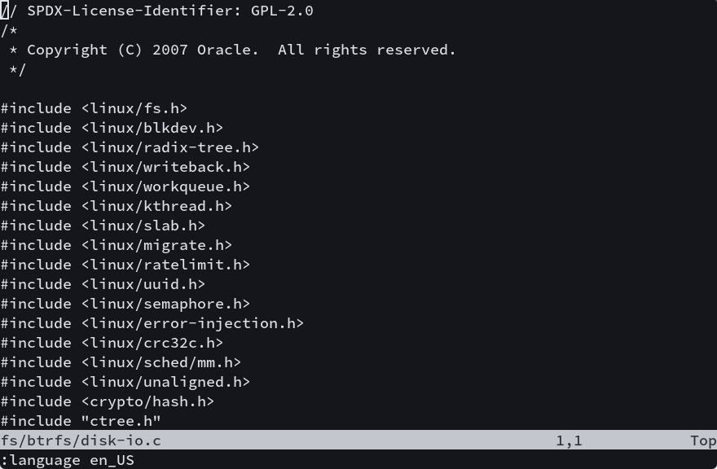
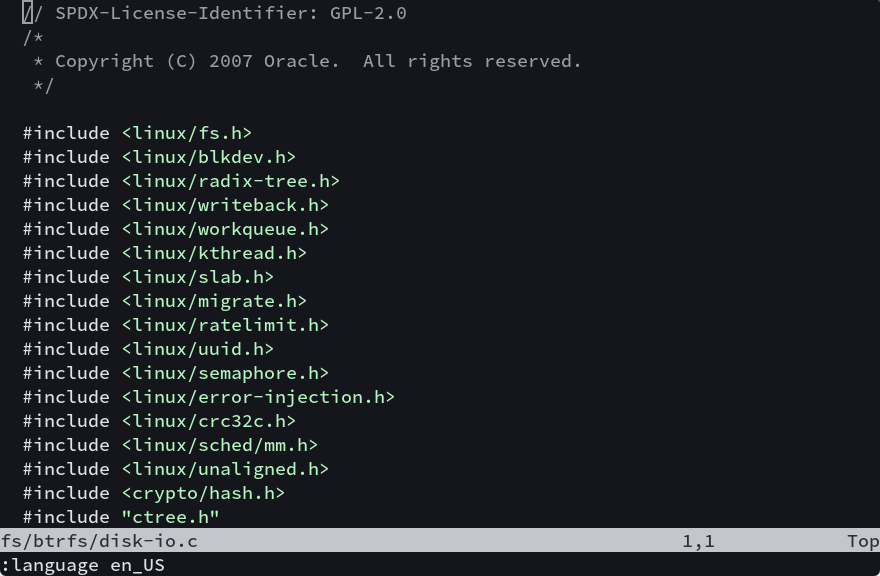
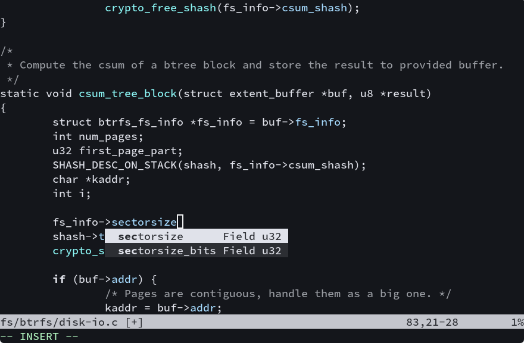
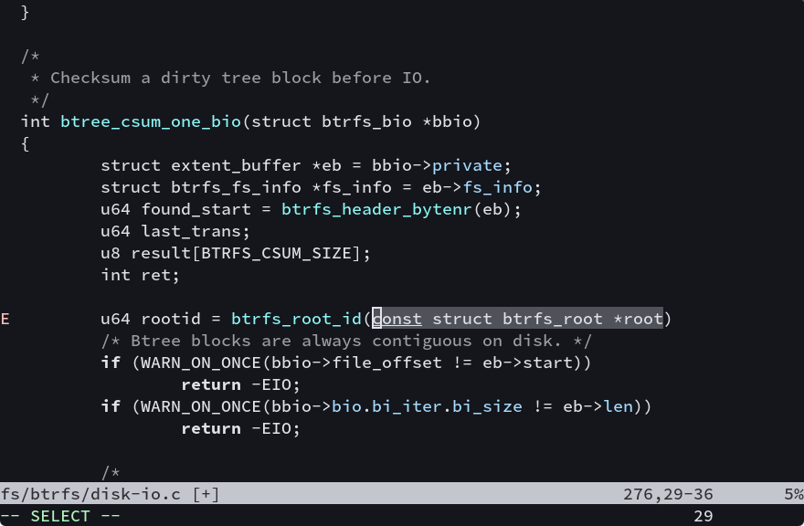

# Objective

Create a neovim based IDE environment using built-in features only. No plugin manager nor plugins other than `lspconfig`.

# Knowledge needed

Nothing except know how to use vim/nvim as an end user.

I didn't have written any Lua code until this project.

# History

I have used vim for years doing kernel and btrfs-progs development, but it's not always as easy as nowadays.

## Ctags era

In the old days before LSP, it was pretty bad, code lookup was all done through [ctags](https://en.wikipedia.org/wiki/Ctags).
But ctags is not compiler, it can not understand a lot of macros.

E.g. function `btrfs_set_file_extent_disk_bytenr()` inside `btrfs_insert_hole_extent()` function from `fs/btrfs/file-item.c` file.

If using ctags, it will return no declaration nor definition.


## Early days with LSP

If my memory is still correct, [YouCompleteMe](https://github.com/ycm-core/YouCompleteMe) and [vim-lsp](https://github.com/prabirshrestha/vim-lsp)
were the two early vim LSP clients I tried.

I didn't have a good experience with YCM either, I guess it was related to my incorrect setup at the time, but IIRC
at the early days it was not even a full LSP client, and still a very complex system to setup, involving a lot of
scripts (python?) out of vim.

Vim-lsp is much better experience, but at that time I still need to do a per-project LSP server setup, so that different projects
can use their own `compile_commands.json` file.
Furthermore at that time, not a lot of projects are ignoring `compile_commands.json`.
E.g. kernel gitignore for `compile_commands.json` was only [added](https://git.kernel.org/pub/scm/linux/kernel/git/torvalds/linux.git/commit/?id=26c4c71bcd9a9f2baf8334995b31f718854f7f42) in 2019.

I had to maintain a centralized `compile_commands.d`
directory for all projects, and manually add entries for each new projects.

But I still remember the joy when `C-]` properly jumps to the `BTRFS_SETGET_FUNCS()` declaring accessors for `btrfs_set_file_extent_disk_bytes()`.

## Problems showing up
However good days never last, for large structures (e.g. `btrfs_fs_info`) the members of the structure is either truncated
during auto-completion, or can take a long time for certain LSP parsing.

It was more or less acceptable when developing locally with a beefy PC, but everything changed when I got an RPI (2?) SBC.
Now arm is new the hot platform, trying to run Archlinux with upstream kernel is my latest experiment.

And I didn't know why but I choose to edit the code on RPI (2 or 3?) and compile the kernel natively, suddenly I got no
LSP support.

When setting up the environment again, the old problems just show up again:

- Even slower completion 
- Centralized `compile_commands.d` directory
- Mim config that depends on all kinds of plugins
- Various regressions between different plugins

  Now my pc and sbc are having different versions (hey, who will
  try to update their plugins when they all work fine?) and behaviors.

And all above problems are also preventing me from spread the enlightenment of LSP.

## The new hope
Then the project neovim came, with Lua as the main script language. Well, the script language doesn't make that much difference,
I can not read vim script nor lua, so they are the same to me mostly.

But the important thing is, neovim has built-in LSP client support, and with the help of Lua it's also way faster parsing LSP info.

Then I jumped the ship of Vim and changed to neovim.

But unfortunately there are still problems:

- Centralized `compile_commands.d` directory

  This time it's mostly on me, I was passing other clangd options to work around various
  quirks anway, thus I keept the per-project clangd setup and point the search path to the
  old `compile_commands.d` directory, even I know this is not expandable.

- Still all kinds of nvim plugins, along with less vim plugins

  The biggest reason for the extra plugins were the missing of snippet engine.
  At that time I was using [LuaSnip](https://github.com/L3MON4D3/LuaSnip) alone with
  [cmp](https://github.com/hrsh7th/nvim-cmp) and all kinds of extra plugins from [hrsh7th](https://github.com/hrsh7th).

  I think all those plugins are just to make auto-completion work, because that's the only
  working setup to an end user without Lua/Vim-script experience.
  The only changes that I can do is to change the keymap, and the keymay change didn't even always work.

Hey, at least the setup worked (and worked for a long time), and it is way faster than the old setup.
And I haven't touched it for quite some time.

## The simplest one to rule them all

Now neovim 0.11 has integrated everything I needed for simple LSP based auto-completion:

- LSP client
- Snippet engine
- Auto-completion

Finally we're at the beginning of the adventure. To build the simplest neovim IDE, with the minimal amount of
init.lua.
And this time, NO MORE DAMN PLUGINS!! (*)

(*): Except [lspconfig](https://github.com/neovim/nvim-lspconfig)

# Setup

Linux kernel and btrfs-progs will be the two example projects used in the setup.

## Preparation for clangd

Since both Linux kernel and btrfs-progs are mostly C, will use [clangd](https://github.com/clangd/clangd)
as the LSP server.
And `clangd` requires a `compile_commands.json` file to work.

For Linux kernel, there is already a script to generate that file, but it's recommended
to build the kernel (with your target module compiled) using LLVM first.
If using GCC (the default) the generated file will include GCC specific flags and cause unnecessary
warnings:

```
cd linux
make LLVM=1 -j12
./scripts/clang-tools/gen_compile_commands.py
```

For btrfs-progs, it's using the traditional auto-tools, one can use [bear](https://github.com/rizsotto/Bear)
to generate the `compile_commands.json` file:

```
cd btrfs-progs
make clean -j12
bear -- make -j12
```

## The minimal config

This tutorial is based on nvim 0.11.5, please make sure neovim 0.11.x is installed.
One may use testing branch to get the latest neovim package on certain distros.

Firstly, try nvim with all the default setting, without any plugins (by default
nvim will try to load all vim plugins):

```bash
$ cd linux
$ nvim -u NONE fs/btrfs/disk-io.c
```

This should result no highlight (as the default filetype based highlight is also disabled):



Then this is the minimal config, which includes only `clangd` as LSP server for C files only:

```lua
-- Define the LSP server for clangd
vim.lsp.config['clangd'] = {
  -- Command of the LSP server
  cmd = { 'clangd' },

  -- File type to trigger the lsp server
  filetypes = { 'c' },

  -- Marker files to determine the project root
  root_markers = { 'compile_commands.json' },
}

-- Enable the clangd LSP server defined above
vim.lsp.enable('clangd')
```

Save above file as `init.lua` and put it where you like (no need to replace the nvim's `init.lua`).
Then load it with:

```bash
$ cd linux
$ nvim -n init.lua
```

This will disable all plugin and read `init.lua` as the config.

Then open the file `fs/btrfs/disk-io.c`, you should see the file with highlights properly enabled like this:



This means the LSP server `clangd` is working properly with the `compile_commands.json`.

And you can already do basic completion using `C-xC-o` keys:



For more details, refer to `:help lsp-quickstart`
## With lspconfig

Neovim project itself also maintain [nvim-lspconfig](https://github.com/neovim/nvim-lspconfig) projects, which
has very good default settings for all common lsp server.

Some rolling distros have also that package too:
- [Archlinux](https://archlinux.org/packages/extra/any/neovim-lspconfig/)
- [OpenSUSE](https://software.opensuse.org/package/nvim-lspconfig)

With that package installed, the minimal config can be even smaller, and have better default config
(e.g. `cpp` file support)

```lua
vim.lsp.enable('clangd')
```

And even enable more languages, without bothering setting them up for each project:

```lua
vim.lsp.enable('clangd')

-- For rust
vim.lsp.enable('rust_analyzer')
```

## Enable auto-complete

With above setup, it's possible to complete function name and member names, but there is no auto-completion for
function parameters.
This feature needs to be manually enabled through the following part in the `init.lua` file:

```lua
vim.api.nvim_create_autocmd('LspAttach', {
  callback = function(ev)
    local client = vim.lsp.get_client_by_id(ev.data.client_id)

	if client:supports_method('textDocument/completion') then
      vim.lsp.completion.enable(true, client.id, ev.buf, { autotrigger = true })
    end
  end
})
```

This will enable auto-completion for lsp servers that support it (clangd supports it).

Now auto-completion works as expected:



The keys sequence is:

```
btrfs_root_i<C-xC-o><C-y>
```

Where `<C-y>` expands the selected item, which is `btrfs_root_id()` function,
and now one can input to replace the parameter placeholder.
And `<Tab>` to jump to the next jump point. In this case there is no more parameter,
and will jump to the end of the function.

For the default keymaps, refer `:help lsp-defaults` for more info.

Now the minimal IDE is already finished, with just the following configs:

```lua
vim.lsp.enable('clangd')
vim.lsp.enable('rust_analyzer')

vim.api.nvim_create_autocmd('LspAttach', {
  callback = function(ev)
    local client = vim.lsp.get_client_by_id(ev.data.client_id)

	if client:supports_method('textDocument/completion') then
      vim.lsp.completion.enable(true, client.id, ev.buf, { autotrigger = true })
    end
  end
})
```

# More customization

Personally speaking I'm pretty happy with the default LSP keymaps, but don't like to
use `<Tab>` to move between jump points.

E.g. map `<C-h>` for jump to the previous jump point and `<C-l>` for the next:

```lua
vim.keymap.set({ 'i', 's' }, '<C-l>', function()
  if vim.snippet.active({ direction = 1 }) then
    return '<Cmd>lua vim.snippet.jump(1)<CR>'
  end
end, { desc = '...', expr = true, silent = true })

vim.keymap.set({ 'i', 's' }, '<C-h>', function()
  if vim.snippet.active({ direction = -1 }) then
    return '<Cmd>lua vim.snippet.jump(-1)<CR>'
  end
end, { desc = '...', expr = true, silent = true })

```

Refer to `:help vim.snippet` for the jump related key mapping examples.

And the default `completeopt` will always pre-select the first time, and won't show up the menu
if there is only one matching item.
I prefer the popup menu always show up even if there is only one item, and only pre-select
the longest matchine text:

```lua
vim.opt.completeopt = "menuone,popup,longest"
```

# Final cleanup

So far we are testing the minimal config using `nvim -u <file>` option, which disables all plugins.

Now it's time to cleanup any plugins that can be replaced by the minimal setup, but you still
want to use, e.g. colorscheme, git integration etc.

And one may also want to cleanup `~/.local/state/nvim` and `~/.local/share/nvim` directories.

After that you can replace the nvim's `init.lua` with the minimal ones.

Enjoy a minimal but still working neovim setup.

# My personal setup

Here is the personal setup I'm using, replacing 95% of my previous [nvim-cmp](https://github.com/hrsh7th/nvim-cmp) setup.

There are some vim plugins installed, which are all provided by the Archlinux official repo:

- neovim-lspconfig
- vim-airline
- vim-airline-themes
- vim-fugitive
- vim-molokai

```lua
-- LSP
vim.lsp.config.clangd = {
  -- Add clangd option to disable automatical header insertion
  cmd = { 'clangd', '--header-insertion=never' },
}
vim.lsp.enable('clangd')
vim.lsp.enable('rust_analyzer')

vim.api.nvim_create_autocmd('LspAttach', {
  callback = function(ev)
    local client = vim.lsp.get_client_by_id(ev.data.client_id)

    if client:supports_method('textDocument/completion') then
      vim.lsp.completion.enable(true, client.id, ev.buf, { autotrigger = true })
    end
  end
})


vim.keymap.set({ 'i', 's' }, '<C-l>', function()
  if vim.snippet.active({ direction = 1 }) then
    return '<Cmd>lua vim.snippet.jump(1)<CR>'
  end
end, { desc = '...', expr = true, silent = true })

vim.keymap.set({ 'i', 's' }, '<C-h>', function()
  if vim.snippet.active({ direction = -1 }) then
    return '<Cmd>lua vim.snippet.jump(-1)<CR>'
  end
end, { desc = '...', expr = true, silent = true })

-- LSP folding
vim.o.foldmethod = "expr"
vim.o.foldexpr = "v:lua.vim.lsp.foldexpr()"

-- Auto-restore
vim.api.nvim_create_autocmd("BufReadPost", {
  desc = "Auto jump to last position",
  group = vim.api.nvim_create_augroup("auto-last-position", { clear = true }),
  callback = function(args)
    local position = vim.api.nvim_buf_get_mark(args.buf, [["]])
    local winid = vim.fn.bufwinid(args.buf)
    pcall(vim.api.nvim_win_set_cursor, winid, position)
  end,
})
-- Colorscheme
vim.cmd.colorscheme('molokai')
vim.cmd.highlight('Normal guibg=NONE')
vim.cmd.highlight('NonText guibg=NONE')
vim.cmd.highlight('Comment guifg=#808080')

-- Basic config
vim.opt.fileencodings = "utf-8,cp932,cp936"
vim.opt.bk = false
vim.opt.swapfile = false
vim.opt.autoread = true
vim.opt.autowrite = true
vim.opt.wildmode = "longest,list,full"
vim.opt.number = true
vim.opt.completeopt = "menuone,popup,longest"
vim.opt.winborder = "rounded"
```
